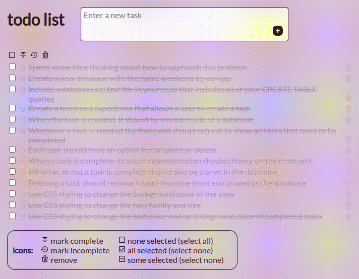

# Todo List

## Description

_Duration: 3 Week Sprint_

A simple app for managing a to-do list. Uses icon symbols with hovertext for a clean, uncluttered interface.

Basic functionality:

 - Add tasks
 - Mark tasks complete/incomplete
 - Remove tasks

Extra functionality:

 - Select all/none
 - Mark tasks complete/incomplete in batch
 - Remove tasks in batch

## Screen Shot

### Prerequisites

Link to software that is required to install the app (e.g. node).

- [Node.js](https://nodejs.org/en/)

## Installation

1. Create a database named `weekend-to-do-app`.
2. Use the queries in `database.sql` to initialize the `todos` table in the database.
3. Open up your editor of choice and run an `npm install`
4. Run `npm run server` in your terminal
5. Run `npm run client` in your terminal
6. The `npm run client` command will open up a new browser tab for you!

## Usage

How does someone use this application? Tell a user story here.

1. To start from scratch, click the "Select All" icon, followed by the "Remove" icon. (See icon key at the bottom, or hover over icons to see what they do.)
2. Add new tasks with the text input field at the top right hand of the page.
3. Check off individual tasks by hovering over them and clicking the "Mark Complete" icon.
4. You can also reset a task back to incomplete using the "Mark Incomplete" icon.
5. To permanently remove a task from the list, click the "Remove" icon next to it.
6. Steps 3-5. can be done in batch using the checkboxes and the icons at the top.

## Built With

[ReactJS](https://react.dev/)

## Acknowledgement
Thanks to [Prime Digital Academy](www.primeacademy.io) who equipped and helped me to make this application a reality.
